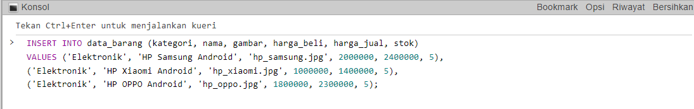

Praktikum 8: PHP dan Database MySQL
Repository ini dibuat untuk memenuhi tugas Pemrograman Web
| Nama      | Lydia Diffani Siregar |
| ----------- | ----------- |
| NIM     | 312010498       |
| Kelas   | TI.20.A.1        |


## Langkah langkah praktikum 8 "PHP dan Database MySQL"
Langkah pertama yaitu menyiapkan XAMPP


Setelah muncul XAMPP, langkah selanjutnya yaitu menjalankan MySQL.
Dengan klik star Apache dan MySQL, kemudian klik admin pada bagian MySQL.


Kemudian buka melalui browser: http://localhost/phpmyadmin/

Akan muncul seperti ini:


Setelah muncul seperti gambar diatas, langkah selanjutnya yaitu Membuat Database baru di phpmyadmin dengan nama latihan1 


Bisa juga dengan cara ketik <b>CREATE DATABASE latihan1;(didalam konsul)


Langkah selanjutnya membuat tabel dengan format
```php CREATE TABLE data_barang (
id_barang int(10) auto_increment Primary Key,
kategori varchar(30),
nama varchar(30),
gambar varchar(100),
harga_beli decimal(10,0),
harga_jual decimal(10,0),
stok int(4)
);```

format dapat diletakkan di konsol atau SQL
Ini tampilan di Konsol:


Ini Tampilan di SQL:


Kemudian menambahkan Data dengan format :
```php INSERT INTO data_barang (kategori, nama, gambar, harga_beli, harga_jual, stok)
VALUES ('Elektronik', 'HP Samsung Android', 'hp_samsung.jpg', 2000000, 2400000, 5),
('Elektronik', 'HP Xiaomi Android', 'hp_xiaomi.jpg', 1000000, 1400000, 5),
('Elektronik', 'HP OPPO Android', 'hp_oppo.jpg', 1800000, 2300000, 5);``` 

Letakkan format di SQL atau Konsol, saat ini saya meletakkan di SQL


Inilah hasil formatnya

