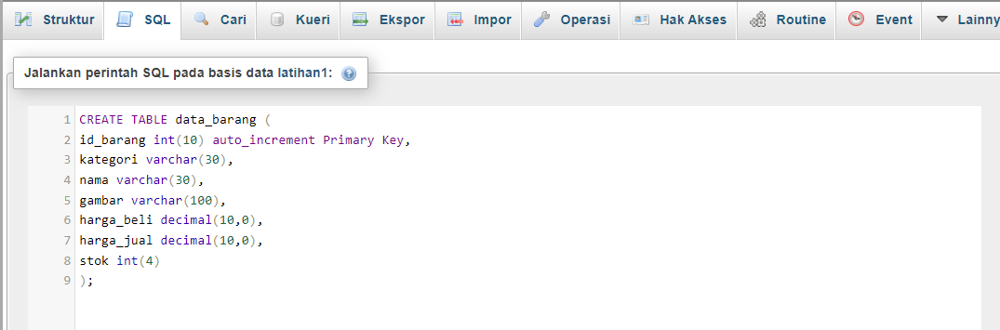

## Praktikum 8: PHP dan Database MySQL
Repository ini dibuat untuk memenuhi tugas Pemrograman Web
| Nama      | Lydia Diffani Siregar |
| ----------- | ----------- |
| NIM     | 312010498       |
| Kelas   | TI.20.A.1        |


## Langkah langkah praktikum 8 "PHP dan Database MySQL"
Langkah pertama yaitu menyiapkan XAMPP


Setelah muncul XAMPP, langkah selanjutnya yaitu menjalankan MySQL.
Dengan klik star Apache dan MySQL, kemudian klik admin pada bagian MySQL.


Kemudian buka melalui browser: http://localhost/phpmyadmin/

Akan muncul seperti ini:


Setelah muncul seperti gambar diatas, langkah selanjutnya yaitu Membuat Database baru di phpmyadmin dengan nama latihan1 


Bisa juga dengan cara ketik <b>CREATE DATABASE latihan1;(didalam konsul)


Langkah selanjutnya membuat tabel dengan format
```php CREATE TABLE data_barang (
id_barang int(10) auto_increment Primary Key,
kategori varchar(30),
nama varchar(30),
gambar varchar(100),
harga_beli decimal(10,0),
harga_jual decimal(10,0),
stok int(4)
);
```

format dapat diletakkan di konsol atau SQL
Ini tampilan di Konsol:


Ini Tampilan di SQL:


Kemudian menambahkan Data dengan format :
```php
INSERT INTO data_barang (kategori, nama, gambar, harga_beli, harga_jual, stok)
VALUES ('Elektronik', 'HP Samsung Android', 'hp_samsung.jpg', 2000000, 2400000, 5),
('Elektronik', 'HP Xiaomi Android', 'hp_xiaomi.jpg', 1000000, 1400000, 5),
('Elektronik', 'HP OPPO Android', 'hp_oppo.jpg', 1800000, 2300000, 5);
``` 

Letakkan format di SQL atau Konsol, saat ini saya meletakkan di SQL


Inilah hasil formatnya


## Membuat Program CRUD
Saya akan membuat folder baru directory web server (d:\xampp\htdocs) dengan nama lab8_php_database


Kemudian untuk mengakses direktory tersebut pada web server dengan mengakses URL: http://localhost/lab8_php_database/


Membuat file koneksi database
Buat file baru di VSC dengan nama koneksi.php dengan format
```php
<?php
$host = "localhost";
$user = "root";
$pass = "";
$db = "latihan1";
$conn = mysqli_connect($host, $user, $pass, $db);
if ($conn == false)
{
echo "Koneksi ke server gagal.";
die();
} #else echo "Koneksi berhasil";
?>
```

Buka melalui browser untuk menguji koneksi database (untuk menyampilkan pesan koneksi berhasil, uncomment pada perintah echo “koneksi berhasil”;


Membuat file index untuk menampilkan data (Read)
Buat file baru dengan nama index.php dengan format:
```php <?php
include("koneksi.php");
// query untuk menampilkan data
$sql = 'SELECT * FROM data_barang';
$result = mysqli_query($conn, $sql);
?>
<!DOCTYPE html>
<html lang="en">
<head>
    <meta charset="UTF-8">
    <link href="style.css" rel="stylesheet" type="text/css" />
<title>Data Barang</title>
</head>
<body>
    <div class="container">
        <h1>Data Barang</h1>
        <div class="main">
            <table>
            <tr>
                <th>Gambar</th>
                <th>Nama Barang</th>
                <th>Katagori</th>
                <th>Harga Jual</th>
                <th>Harga Beli</th>
                <th>Stok</th>
                <th>Aksi</th>
            </tr>
            <?php if($result): ?>
            <?php while($row = mysqli_fetch_array($result)): ?>
            <tr>
                <td>" alt="<?=
$row['nama'];?>"></td>
                <td><?= $row['nama'];?></td>
                <td><?= $row['kategori'];?></td>
                <td><?= $row['harga_beli'];?></td>
                <td><?= $row['harga_jual'];?></td>
                <td><?= $row['stok'];?></td>
                <td><?= $row['id_barang'];?></td>
            </tr>
            <?php endwhile; else: ?>
            <tr>
                <td colspan="7">Belum ada data</td>
            </tr>
            <?php endif; ?>
            </table>
        </div>
    </div>
</body>
</html>
```